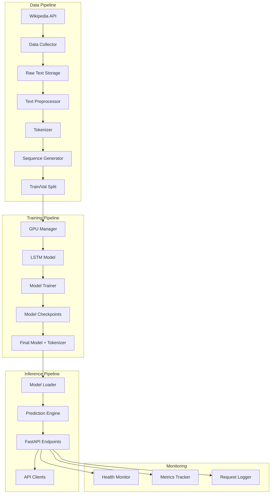

# Design Document: LSTM Text Prediction System

## Overview

The LSTM Text Prediction System is a production-ready machine learning service that provides next-word prediction capabilities through a RESTful API. The system collects Wikipedia articles on AI/ML topics, trains a bidirectional LSTM neural network with GPU acceleration, and exposes prediction functionality through FastAPI endpoints.

### Key Features

- **Automated Data Pipeline**: Wikipedia article collection, preprocessing, tokenization, and sequence generation
- **GPU-Accelerated Training**: NVIDIA GPU support with automatic fallback to CPU
- **Bidirectional LSTM Architecture**: 256-dim embeddings, 512-unit bidirectional LSTM, 256-unit unidirectional LSTM
- **Multiple Prediction Modes**: Single prediction, top-k predictions, batch processing, text completion
- **Production-Ready API**: FastAPI with Swagger docs, CORS support, health monitoring, metrics tracking
- **Type-Safe Codebase**: Full type hints, comprehensive docstrings, mypy strict mode compliance

### Technology Stack

- **ML Framework**: TensorFlow 2.x with GPU support
- **API Framework**: FastAPI with Uvicorn ASGI server
- **Data Source**: Wikipedia API
- **Validation**: Pydantic models
- **Testing**: pytest with async support
- **Console UI**: Rich library for beautiful terminal output
- **Language**: Python 3.10+

## Architecture

### High-Level System Architecture



### Module Organization

```
lstm-text-prediction/
├── src/
│   ├── data/
│   │   ├── __init__.py
│   │   ├── collector.py          # Wikipedia data collection
│   │   ├── preprocessor.py       # Text cleaning and preprocessing
│   │   ├── tokenizer.py          # Vocabulary building and tokenization
│   │   └── sequence_generator.py # Training sequence creation
│   ├── model/
│   │   ├── __init__.py
│   │   ├── gpu_manager.py        # GPU detection and configuration
│   │   ├── lstm_model.py         # LSTM architecture definition
│   │   ├── trainer.py            # Model training logic
│   │   └── predictor.py          # Prediction engine
│   ├── api/
│   │   ├── __init__.py
│   │   ├── app.py                # FastAPI application
│   │   ├── models.py             # Pydantic request/response models
│   │   ├── endpoints/
│   │   │   ├── __init__.py
│   │   │   ├── prediction.py     # Prediction endpoints
│   │   │   ├── model_info.py     # Model information endpoints
│   │   │   └── health.py         # Health and metrics endpoints
│   │   └── middleware/
│   │       ├── __init__.py
│   │       ├── logging.py        # Request logging middleware
│   │       └── timing.py         # Response time tracking
│   └── utils/
│       ├── __init__.py
│       ├── config.py             # Configuration management
│       └── logger.py             # Logging configuration
├── scripts/
│   ├── run_training.py           # Training pipeline script
│   └── run_api.py                # API server script
├── tests/
│   ├── __init__.py
│   ├── test_data_pipeline.py     # Data pipeline tests
│   ├── test_model.py             # Model tests
│   ├── test_api.py               # API endpoint tests
│   └── test_performance.py       # Performance tests
├── data/
│   ├── raw/                      # Raw Wikipedia articles
│   └── processed/                # Processed training data
├── models/                       # Saved models and tokenizers
├── notebooks/
│   └── development_workflow.ipynb
├── requirements.txt
├── README.md
└── .gitignore
```

### Component Dependencies

```mermaid
graph LR
    A[config.py] --> B[collector.py]
    A --> C[preprocessor.py]
    A --> D[tokenizer.py]
    A --> E[sequence_generator.py]
    A --> F[gpu_manager.py]
    A --> G[lstm_model.py]
    A --> H[trainer.py]
    A --> I[predictor.py]
    A --> J[app.py]
    
    D --> E
    F --> G
    G --> H
    G --> I
    D --> I
    I --> J
    
    B --> C
    C --> D
    E --> H
